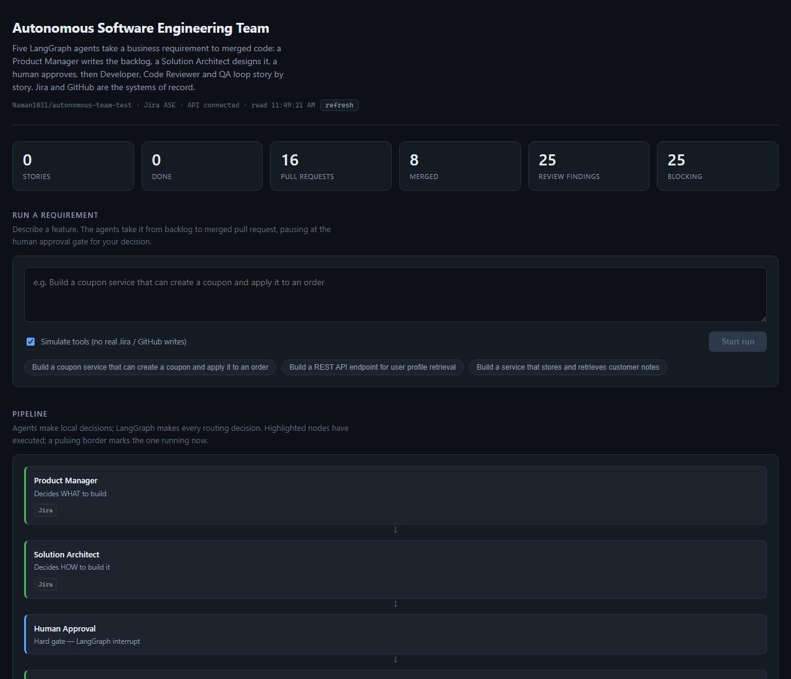
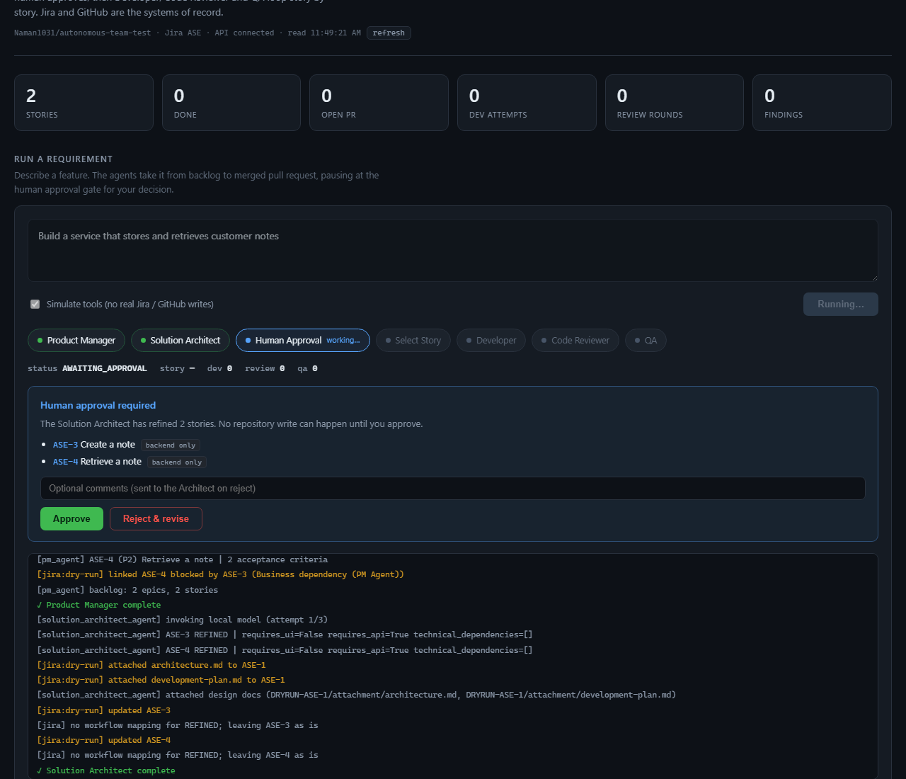
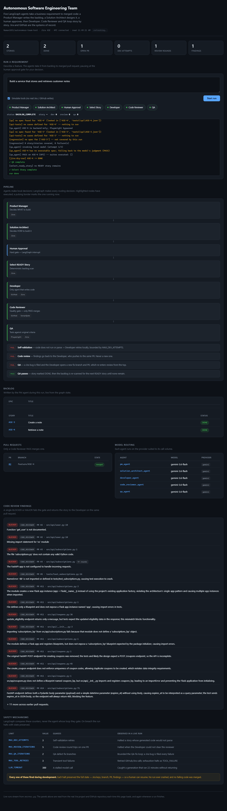

## Autonomous Software Engineering Team

**An autonomous software engineering team.** Five LLM agents take a business
requirement from an empty backlog to merged code — a Product Manager writes the
stories, a Solution Architect designs the build, a human approves, and then a
Developer, Code Reviewer and QA agent loop story by story until the backlog is
done.

Jira and GitHub are the systems of record. The agents don't simulate a workflow;
they write real issues, open real branches, review real diffs and merge real
pull requests.



---

## How it works

Built on [LangGraph](https://langchain-ai.github.io/langgraph/). The graph owns
every routing decision; the agents only decide things inside their own role.

```
START → Product Manager → Solution Architect → ┌─ HUMAN APPROVAL ─┐
                                ▲              └────────┬─────────┘
                                │  REJECTED             │ APPROVED
                                └───────────────────────┤
                                                        ▼
                            ┌──────────────── Select READY story ──────→ END
                            │                           │        (none left)
                            │                           ▼
                            │                      Developer ◄──────┐
                            │                           │           │
                            │                           ▼           │ FAIL
                            │                     Code Reviewer ────┘
                            │                           │ PASS → merge
                            │                           ▼
                            └───────── FAIL ────────    QA
                                                        │ PASS
                                                        ▼
                                              next story / END
```

### The five agents

| Agent | Decides | Tools |
|---|---|---|
| Product Manager | **what** to build — epics, stories, acceptance criteria | Jira |
| Solution Architect | **how** to build it — design, technical dependencies, UI/API scope | Jira |
| Developer | the implementation — the only agent that writes code | GitHub, Jira |
| Code Reviewer | whether it ships — the only actor permitted to merge | GitHub, SonarQube |
| QA | whether it works — tested against the original acceptance criteria | Playwright, Jira |

### Two ideas the design rests on

**Agents decide locally; the graph decides routing.** An agent reports what it
found — "review failed", "self-validation passed" — and LangGraph compares that
against the retry counters and chooses the next node. No agent can grant itself
another attempt, and no agent can merge its own code.

**State holds pointers, not content.** `WorkflowState` carries issue keys, a
branch name and a PR number. The story text lives in Jira and the code lives in
GitHub, so an agent always reads the current truth rather than a stale copy
passed down the graph.

---

## Safety mechanisms

Every loop in the graph is bounded, and the bound is enforced by the graph —
never by the agent whose loop it limits. On breach the run halts with its state
preserved and the reason recorded.

| Limit | Guards against |
|---|---|
| `MAX_DEV_ATTEMPTS` | a Developer that cannot produce working code |
| `MAX_REVIEW_ITERATIONS` | a Developer and Reviewer that cannot agree |
| `MAX_QA_ITERATIONS` | an endless defect-fix cycle |
| `MAX_TOOL_RETRIES` | a flaky or failing Jira/GitHub call |
| `LLM_TIMEOUT` | a generation that never returns |

The human approval gate is a real LangGraph `interrupt()`: the graph persists
and suspends, and **no repository-mutating node is reachable until a human
resumes it.**



---

## Running it

### Requirements

- Python 3.11+
- Node 18+
- A Jira project and a GitHub repository the agents can write to
- An API key for one model provider (Gemini or Groq; Ollama runs locally)

### Setup

```bash
pip install -r requirements.txt
#cp .env.example .env        # then fill in your tokens
cd frontend && npm install
```

### The dashboard

```bash
python server.py                    # API on :8000
cd frontend && npm run dev          # dashboard on :5173
```

Type a requirement, watch the agents work, approve at the gate.



### Rehearsing for free

`demo_server.py` serves the same API with the model answered by a local stub and
all external tools simulated. The dashboard cannot tell the difference, but
nothing is sent over the network and no quota is spent — so the whole flow can
be practised as often as you like.

```bash
python demo_server.py               # instead of server.py
```

### The command line

```bash
python main.py "Build a coupon service that applies a discount to an order"
python main.py --check-llm          # one request per configured model
python main.py --dry-run            # simulate Jira, GitHub and SonarQube
```

### Tests

```bash
python -m pytest
```

---

## Configuration

All configuration is environment variables — see `.env.example` for the full
list. The ones worth knowing:

| Variable | Purpose |
|---|---|
| `AGENT_MODELS` | per-agent model routing, e.g. `code_reviewer_agent=gemini:gemini-3.6-flash` |
| `TOOLS_DRY_RUN` | `auto` uses a real service wherever credentials exist and simulates the rest |
| `MAX_*` | the retry and iteration limits above |
| `GEMINI_THINKING_LEVEL` | bounds reasoning so it does not consume the output budget |

Agents can be mixed across providers — a cheap model for the backlog, a stronger
one for code review — by naming each one in `AGENT_MODELS`.

---

## Project layout

```
agents/        the five agents, one module each
core/          graph.py (routing), state.py (schema), prompts.py
tools/         jira_client, github_client, testing_tools
frontend/      React dashboard (Vite)
docs/agents/   the specification each agent implements
server.py      HTTP API + live event stream for the dashboard
demo_server.py the same API, stubbed, for free rehearsal
main.py        command-line entry point
```

`docs/agents/` holds the written specification for each agent and for the
orchestration layer. The code follows those documents; they are the reference
for why any part of this behaves the way it does.
